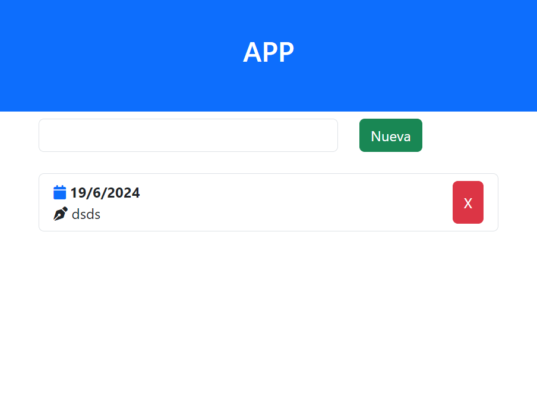

# Aplicación de notas




## Pasos

I. Creo un repositorio

``` bash
    git init
```

II. Configurar el usuario y email
``` bash
    git config user.name "Jonathan Cruz"
    git config user.mail "joanthan.cruz@davinci.edu.ar"
``` 

III. Agrego los archivos
``` bash
    git add index.html
    git add .
``` 

IV. Creo el commit 
``` bash
    git commit -m "Nombre de los cambios"
``` 
V. Vínculamos el repositorio remoto con el local
``` bash
 git remote add origin https://github.com/jonathancruzdev/ejemplo.git
 ```

VI. Subir lo cambios (commits)
``` bash
    git push origin master
```

## Para crear ramas
``` bash
    git branch nombre
``` 
## Para cambiarme rama
``` bash
    git checkout nombre
``` 